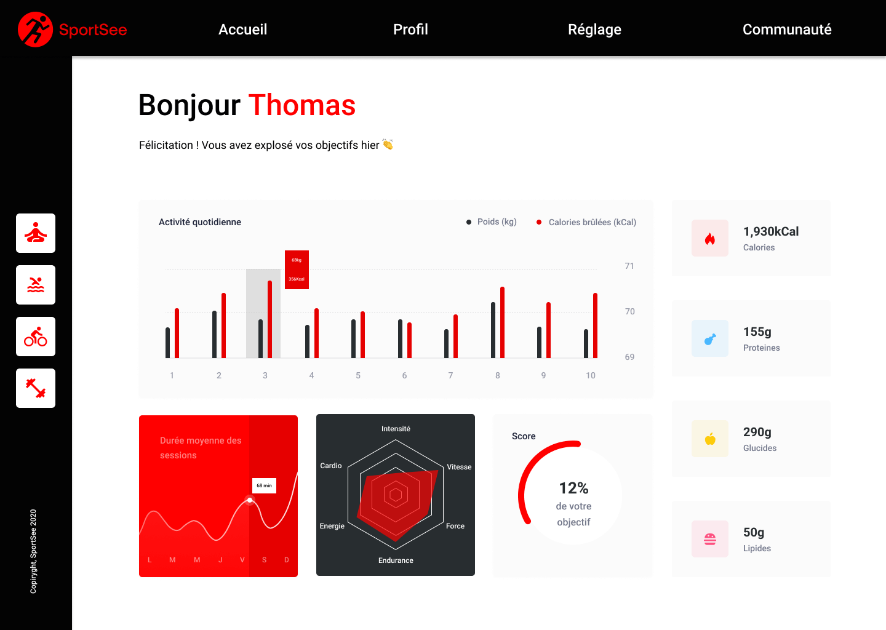

<a name="readme-top"></a>
<!-- PROJECT LOGO -->
<br />
<div align="center">
  <a href="">
    
  </a>

<!-- TABLE OF CONTENTS -->
<details>
  <summary>Table des matières</summary>
  <ol>
    <li><a href="#a-propos-du-projet">À propos du projet</a></li>
    <li><a href="#langagesutilises">langages Utilisés</a></li>
    <li><a href="#installation">Installation</a></li>
    <li><a href="#contact">Contact</a></li>
  </ol>
</details>


<!-- ABOUT THE PROJECT -->
## À propos du projet

SportSee est le projet 12/14 de ma formation OpenClassroom.

Mission : Vous travaillez en tant que développeur chez SportSee, une startup dédiée au coaching sportif. En pleine croissance, l’entreprise va aujourd’hui lancer une nouvelle version de la page profil de l’utilisateur. Cette page va notamment permettre à l’utilisateur de suivre le nombre de sessions réalisées ainsi que le nombre de calories brûlées.

Ce projet nous confie la tâche de développere un tableau de bord d'analytics de coaching sportif et d'intégrer des graphiques, des diagrammes en utilisant React et de récupérer des données via une API. 

Une partie importante du projet sera de développer une documentation complète comprenant un Readme, JSDoc, et les proptypes. Ceci est essentiel pour faciliter la collaboration et la compréhension du code au sein de l'équipe.


 


## Langages utilisés et autres technologies utilisées

[](https://vitejs.dev/)
[](https://nodejs.org/)
[](https://reactjs.org/)
[](https://sass-lang.com/)
[](https://recharts.org/)
[](https://jsdoc.app/)


## Installation

1. Clonez le repository de l'application
   ```sh
   git clone https://github.com/AurelieDuynslaeger/SportSee_P12_OCR.git
   ```

2. Installez les dépendances
    ```sh
   npm install
   ```
   
3. Lancez le projet
    ```sh
   npm run dev
   ```
  
## Contact

Aurélie D. - [GitHub](https://github.com/AurelieDuynslaeger/)

<!-- MARKDOWN LINKS & IMAGES -->
